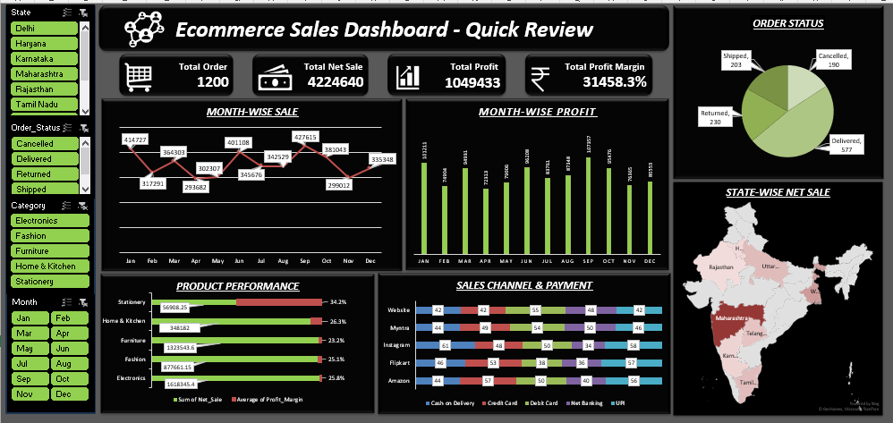

# 🛒 ECOMMERCE SALES & PROFITABILITY DASHBOARD
### An End-to-End Excel Project

> A fully interactive and dynamic Excel dashboard to track E-commerce sales performance, profitability, and customer trends.

**Created By:** Ritu Jagarwal  
**Project Type:** Data Analytics Portfolio Project

---

### 📸 Dashboard Preview

---

### 🎯 Project Objective
To help E-commerce management track sales performance, order status, category-wise profit margin, and regional trends through an interactive Excel Dashboard. This project demonstrates the complete journey from raw data to business insights.

### 📂 Dataset Overview
- **Source:** Ecommerce Sales Raw Data
- **Rows:** 1200+ Orders
- **Key Columns:** Order_ID, Order_Date, State, Category, Sub-Category, Sales, Profit, Order_Status, Month

### 🔧 Process & Workflow
1.  **Data Cleaning:** Removed duplicates, handled (blank) values, fixed date formats, created Cleaned_Data Table.
2.  **Data Transformation:** Created new columns for Month, Year, Profit Margin % using Power Query & Formulas.
3.  **Pivot Tables:** Created 5+ Pivot Tables for KPIs and Charts.
4.  **Dashboarding:** Built KPIs using GETPIVOTDATA, Added Slicers (State, Order_Status, Category, Month) with custom Dark Theme formatting.
5.  **Final Touch:** Designed Cover Page, Field Guide, and Navigation buttons.

### 📊 Dashboard Features

**KPIs Tracked:**
* Total Orders
* Total Sales
* Total Profit
* Total Profit Margin

**Charts Included:**
* **Monthly Sales Trend:** Line chart to track seasonality (Jan-Dec)
* **Order Status Distribution:** Pie chart - Delivered vs Shipped vs Cancelled vs Returned
* **Category-wise Performance:** Bar chart - Electronics, Fashion, Furniture, etc.
* **Top States by Sales:** Regional performance

**Interactive Slicers:**
* State - Filter by Delhi, Haryana, Karnataka, etc.
* Order_Status - Delivered, Shipped, Cancelled, Returned
* Category - Electronics, Fashion, Home & Kitchen, etc.
* Month - Jan to Dec

All slicers are synced with custom black & neon green theme to match dashboard.

### 💡 Key Insights from Dashboard
* **Top Performing State:** Delhi & Maharashtra contribute highest sales.
* **Best Category:** Electronics and Fashion drive maximum profit.
* **Order Status:** ~85% orders are Delivered, Returns are less than 10%.
* **Seasonality:** Sales peak in Jan and Mar months.

### 🛠️ Tools Used
* Microsoft Excel
* Power Query (Data Cleaning)
* Pivot Tables & Pivot Charts
* Slicers with Custom Styles
* GETPIVOTDATA Function
* Conditional Formatting & Dynamic Icons

### 📁 File Navigation
* `Start_Here(Cover)` - Cover Page & Project Navigation
* `Raw_Data` - Original Uncleaned Data
* `Cleaned_Data` - Cleaned Table (Source for Pivot)
* `Pivot_Table` - All backend pivot tables
* `Dashboard` - Final Interactive Dashboard

### ▶️ How to Use
1. Go to `Dashboard` sheet.
2. Use left-side Slicers to filter data by State, Status, Category, Month.
3. All KPIs and Charts will update dynamically.

---
